Analysis for SN Paper 1
================
Saurabh Khanna
2020-03-24

  - [Descriptive Analyses](#descriptive-analyses)
      - [Individual Level Segregation
        Scores](#individual-level-segregation-scores)
      - [Change in number of friends](#change-in-number-of-friends)
      - [Department-grade level
        homophily](#department-grade-level-homophily)
      - [Reciprocity](#reciprocity)
      - [Triad Closure](#triad-closure)
  - [Multivariate Analyses](#multivariate-analyses)

``` r
# Libraries
library(tidyverse)
library(igraph)
library(ggraph)
library(tidygraph)
library(haven)
library(stargazer)

# Parameters
baseline_network_file <- here::here("data/baseline_network.dta")
endline_network_file <- here::here("data/endline_network.dta")
stu_admin_all_file <- here::here("data/stu_admin_all_latest.dta")

#===============================================================================
```

## Descriptive Analyses

Reading in all survey data:

``` r
stu_admin_all <-
  read_stata(stu_admin_all_file) %>% 
  mutate(
    b_seg_studymate = if_else(!is.na(b_integration_studymate), 1 - b_integration_studymate, b_integration_studymate),
    b_seg_friend = if_else(!is.na(b_integration_friend), 1 - b_integration_friend, b_integration_friend),
    e_seg_studymate = if_else(!is.na(e_integration_studymate), 1 - e_integration_studymate, e_integration_studymate),
    e_seg_friend = if_else(!is.na(e_integration_friend), 1 - e_integration_friend, e_integration_friend)
  )
```

Reading in network data:

``` r
b_nodes <- 
  read_stata(baseline_network_file) %>% 
  select(-b_node2) %>% 
  distinct()

b_edges <- 
  read_stata(baseline_network_file) %>% 
  select(b_node1, b_node2) %>%
  filter(b_node2 != "")

e_nodes <- 
  read_stata(endline_network_file) %>% 
  select(-e_node2) %>% 
  distinct()

e_edges <- 
  read_stata(endline_network_file) %>% 
  select(e_node1, e_node2) %>%
  filter(e_node2 != "")

b_network <- 
  graph_from_data_frame(b_edges, b_nodes, directed = TRUE) %>% 
  as_tbl_graph()

e_network <- 
  graph_from_data_frame(e_edges, e_nodes, directed = TRUE) %>% 
  as_tbl_graph()
```

### Individual Level Segregation Scores

``` r
stu_admin_all %>%
  select(starts_with(c("b_seg_stud", "e_seg_stud")), elite, reservation) %>%
  na_if("") %>% 
  drop_na(reservation) %>%
  mutate(
    elite = factor(elite, labels = c("Non-elite", "Elite"))
  ) %>%
  pivot_longer(
    cols = contains("seg_"),
    names_to = "survey",
    values_to = "seg_studymate",
    values_drop_na = TRUE
  ) %>%
  mutate(
    survey = recode(
      survey, 
      "b_seg_studymate" = "Baseline",
      "e_seg_studymate" = "Endline"
    )
  ) %>% 
  ggplot(aes(seg_studymate, stat(density), fill = factor(reservation))) +
  geom_density(alpha = 0.5) +
  facet_grid(vars(elite), vars(survey)) +
  labs(
    x = "Segregation",
    y = "Density",
    fill = "Survey"
  )
```

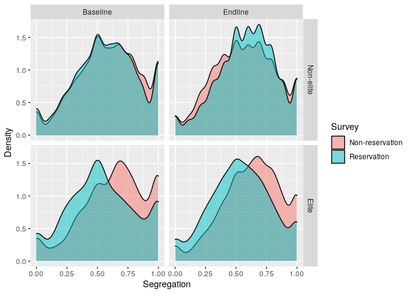<!-- -->

``` r
stu_admin_all %>%
  select(starts_with(c("b_seg_stud", "e_seg_stud")), elite, reservation) %>%
  na_if("") %>% 
  drop_na(reservation) %>%
  mutate(
    elite = factor(elite, labels = c("Non-elite", "Elite"))
  ) %>%
  pivot_longer(
    cols = contains("seg_"),
    names_to = "survey",
    values_to = "seg_studymate",
    values_drop_na = TRUE
  ) %>% 
  ggplot(aes(seg_studymate, stat(density), fill = factor(survey))) +
  geom_density(alpha = 0.5) +
  scale_fill_discrete(
    labels = c("Baseline", "Endline")
  ) +
  facet_grid(vars(elite), vars(reservation)) +
  labs(
    x = "Segregation",
    y = "Density",
    fill = "Survey"
  )
```

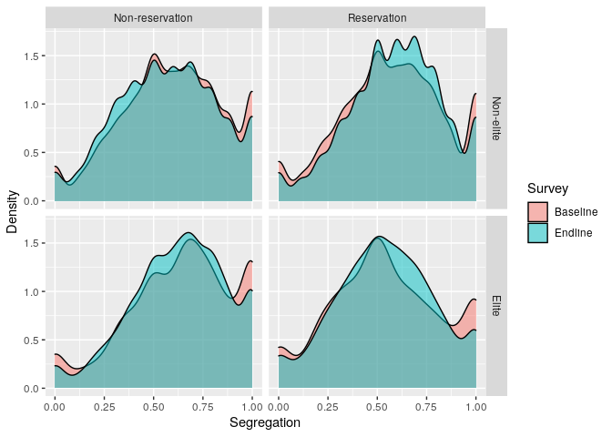<!-- -->

### Change in number of friends

``` r
b_network %>%
  left_join(
    b_edges %>% count(b_node1, name = "b_n_studymates"), 
    by = c("name" = "b_node1")
  ) %>%
  left_join(
    e_edges %>% count(e_node1, name = "e_n_studymates"), 
    by = c("name" = "e_node1")
  ) %>%
  as_tibble() %>%
  na_if("") %>% 
  drop_na(reservation) %>% 
  mutate(
    elite = factor(elite, labels = c("Non-elite", "Elite"))
  ) %>% 
  pivot_longer(
    cols = ends_with("mates"),
    names_to = "time",
    values_to = "n_studymates",
    values_drop_na = TRUE
  ) %>%
  ggplot() +
  geom_bar(aes(n_studymates, fill = time), position = "dodge") +
  facet_wrap(vars(reservation)) +
  scale_x_continuous(breaks = seq(0, 10, 2)) +
  scale_fill_discrete(
    labels = c("Baseline", "Endline")
  ) +
  labs(
    x = "Number of friends",
    y = "Number of students",
    fill = "Survey"
  )
```

    ## Warning: Column `name`/`b_node1` has different attributes on LHS and RHS of join

    ## Warning: Column `name`/`e_node1` has different attributes on LHS and RHS of join

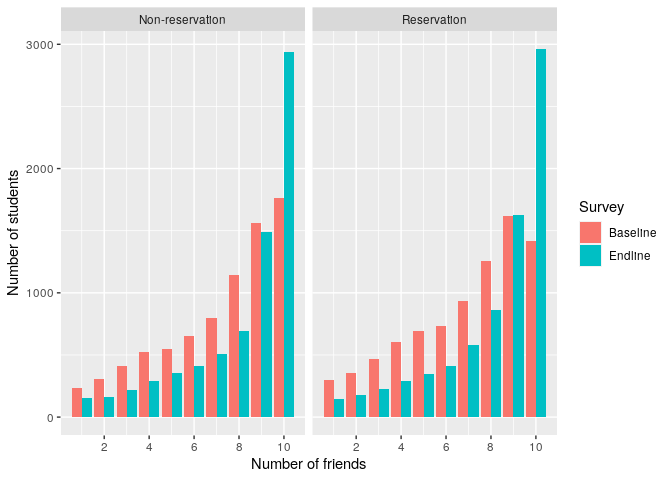<!-- -->

### Department-grade level homophily

``` r
# computed using python
# b_network %>%
#   filter(reservation != "") %>% 
#   mutate(
#     reservation = recode(
#       reservation, 
#       "Reservation" = "1", 
#       "Non-reservation" = "2"
#     ) %>% 
#       parse_integer()
#   ) %>% 
#   assortativity_nominal(V(.)$reservation, directed = TRUE)

b_network %>% 
  as_tibble() %>%
  left_join(read_csv(here::here("data/b_homophilies.csv")), by = "classid") %>%
  bind_rows(
    e_network %>% 
      as_tibble() %>% 
      left_join(read_csv(here::here("data/e_homophilies.csv")), by = "classid"), 
    .id = "survey"
  ) %>% 
  na_if("") %>% 
  drop_na(reservation, homophily) %>%
  mutate(
    elite = factor(elite, labels = c("Non-elite", "Elite"))
  ) %>% 
  mutate(
    survey = recode(
      survey, 
      "1" = "Baseline",
      "2" = "Endline"
    )
  ) %>%
  ggplot(aes(homophily, stat(density), fill = factor(survey))) +
  geom_density(alpha = 0.5) +
  facet_grid(vars(elite), vars(reservation)) +
  labs(
    x = "Homophily",
    y = "Density",
    fill = "Survey"
  )
```

    ## Parsed with column specification:
    ## cols(
    ##   classid = col_character(),
    ##   homophily = col_double()
    ## )
    ## Parsed with column specification:
    ## cols(
    ##   classid = col_character(),
    ##   homophily = col_double()
    ## )

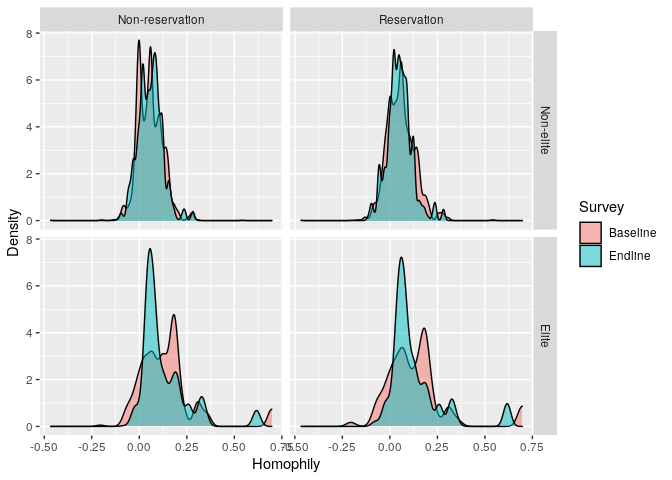<!-- -->

``` r
b_network %>% 
  as_tibble() %>%
  left_join(read_csv(here::here("data/b_homophilies.csv")), by = "classid") %>%
  bind_rows(
    e_network %>% 
      as_tibble() %>% 
      left_join(read_csv(here::here("data/e_homophilies.csv")), by = "classid"), 
    .id = "survey"
  ) %>% 
  na_if("") %>% 
  drop_na(reservation, homophily) %>%
  mutate(
    elite = factor(elite, labels = c("Non-elite", "Elite"))
  ) %>% 
  mutate(
    survey = recode(
      survey, 
      "1" = "Baseline",
      "2" = "Endline"
    )
  ) %>%
  ggplot(aes(homophily, stat(density), fill = factor(reservation))) +
  geom_density(alpha = 0.5) +
  facet_grid(vars(elite), vars(survey)) +
  labs(
    x = "Homophily",
    y = "Density",
    fill = "Reservation"
  )
```

    ## Parsed with column specification:
    ## cols(
    ##   classid = col_character(),
    ##   homophily = col_double()
    ## )
    ## Parsed with column specification:
    ## cols(
    ##   classid = col_character(),
    ##   homophily = col_double()
    ## )

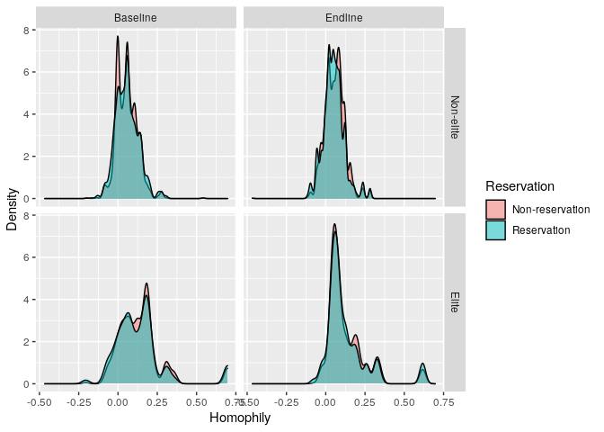<!-- -->

### Reciprocity

``` r
# baseline
b_network <-
  b_network %>%
  mutate(
    reciprocity = map_dbl(
      classid, 
      ~ induced_subgraph(b_network, V(b_network)[classid == .]) %>% 
        reciprocity()
    )
  )

# endline
e_network <-
  e_network %>%
  mutate(
    reciprocity = map_dbl(
      classid, 
      ~ induced_subgraph(e_network, V(e_network)[classid == .]) %>% 
        reciprocity()
    )
  )
```

``` r
b_network %>% 
  as_tibble() %>%
  bind_rows(e_network %>% as_tibble(), .id = "survey") %>%
  na_if("") %>%
  drop_na(reservation, reciprocity) %>%
  mutate(
    survey = factor(survey, labels = c("Baseline", "Endline")),
    elite = factor(elite, labels = c("Non-elite", "Elite"))
  ) %>%
  ggplot(aes(reciprocity, stat(density), fill = factor(survey))) +
  geom_density(alpha = 0.5) +
  facet_grid(vars(elite), vars(reservation)) +
  labs(
    x = "Reciprocity",
    y = "Density",
    fill = "Survey"
  )
```

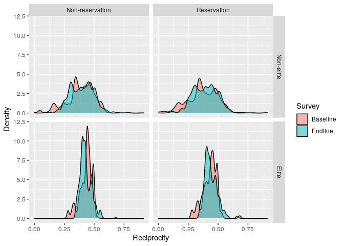<!-- -->

``` r
b_network %>% 
  as_tibble() %>%
  bind_rows(e_network %>% as_tibble(), .id = "survey") %>%
  na_if("") %>%
  drop_na(reservation, reciprocity) %>%
  mutate(
    survey = factor(survey, labels = c("Baseline", "Endline")),
    elite = factor(elite, labels = c("Non-elite", "Elite"))
  ) %>%
  ggplot(aes(reciprocity, stat(density), fill = factor(reservation))) +
  geom_density(alpha = 0.5) +
  facet_grid(vars(elite), vars(survey)) +
  labs(
    x = "Reciprocity",
    y = "Density",
    fill = "Reservation"
  )
```

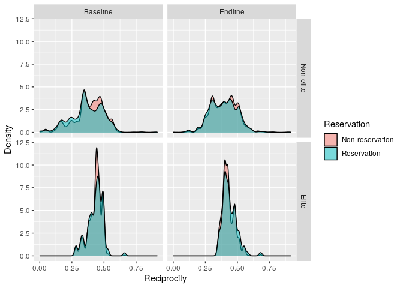<!-- -->

### Triad Closure

``` r
# baseline
b_network <-
  b_network %>%
  mutate(
    transitivity = map_dbl(
      classid, 
      ~ induced_subgraph(b_network, V(b_network)[classid == .]) %>% 
        transitivity()
    )
  )

# endline
e_network <-
  e_network %>%
  mutate(
    transitivity = map_dbl(
      classid, 
      ~ induced_subgraph(e_network, V(e_network)[classid == .]) %>% 
        transitivity()
    )
  )
```

``` r
b_network %>% 
  as_tibble() %>%
  bind_rows(e_network %>% as_tibble(), .id = "survey") %>%
  na_if("") %>%
  drop_na(reservation, transitivity) %>%
  mutate(
    survey = factor(survey, labels = c("Baseline", "Endline")),
    elite = factor(elite, labels = c("Non-elite", "Elite"))
  ) %>%
  ggplot(aes(transitivity, stat(density), fill = factor(survey))) +
  geom_density(alpha = 0.5) +
  facet_grid(vars(elite), vars(reservation)) +
  labs(
    x = "Transitivity",
    y = "Density",
    fill = "Survey"
  )
```

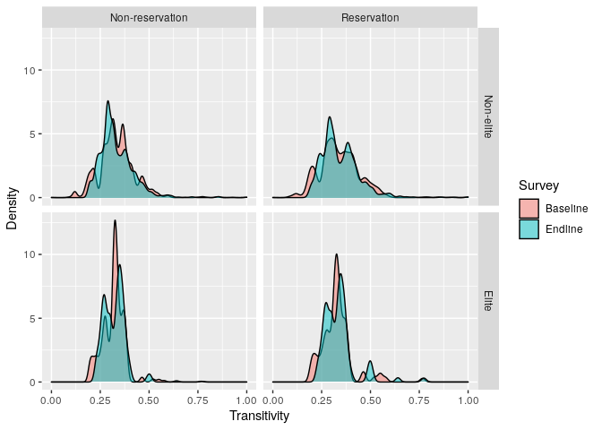<!-- -->

``` r
b_network %>% 
  as_tibble() %>%
  bind_rows(e_network %>% as_tibble(), .id = "survey") %>%
  na_if("") %>%
  drop_na(reservation, transitivity) %>%
  mutate(
    survey = factor(survey, labels = c("Baseline", "Endline")),
    elite = factor(elite, labels = c("Non-elite", "Elite"))
  ) %>%
  ggplot(aes(transitivity, stat(density), fill = factor(reservation))) +
  geom_density(alpha = 0.5) +
  facet_grid(vars(elite), vars(survey)) +
  labs(
    x = "Transitivity",
    y = "Density",
    fill = "Reservation"
  )
```

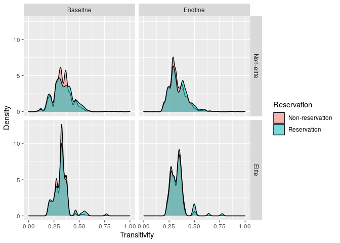<!-- -->

## Multivariate Analyses

Merging transitivity and reciprocity scores with the main dataset:

``` r
stu_admin_all <-
  stu_admin_all %>%
  left_join(
    b_network %>% as_tibble() %>% select(stdid = name, b_reciprocity = reciprocity, b_transitivity = transitivity),
    by = "stdid"
  ) %>%
  left_join(
    e_network %>% as_tibble() %>% select(stdid = name, e_reciprocity = reciprocity, e_transitivity = transitivity),
    by = "stdid"
  )
```

    ## Warning: Column `stdid` has different attributes on LHS and RHS of join
    
    ## Warning: Column `stdid` has different attributes on LHS and RHS of join

Relationship between transitivity/reciprocity and integration scores:

``` r
stu_admin_all %>%
  filter(elite == 0) %>% 
  ggplot() +
  geom_smooth(aes(b_reciprocity, b_seg_studymate), method = "lm", color = "red") +
  geom_smooth(aes(e_reciprocity, e_seg_studymate), method = "lm", color = "blue") +
  labs(
    x = "Reciprocity",
    y = "Segregation"
  )
```

    ## `geom_smooth()` using formula 'y ~ x'

    ## Warning: Removed 3534 rows containing non-finite values (stat_smooth).

    ## `geom_smooth()` using formula 'y ~ x'

    ## Warning: Removed 2646 rows containing non-finite values (stat_smooth).

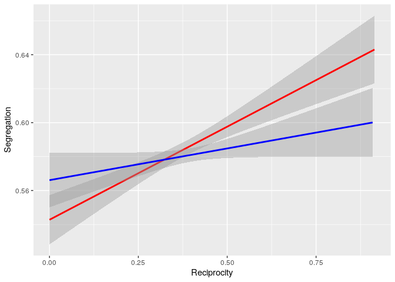<!-- -->

Segregation gain across years:

``` r
stu_admin_all %>% 
  select(classid, stdid, grade, elite, reservation, contains("_seg_stud")) %>% 
  filter(grade == 2) %>% 
  pivot_longer(
    cols = contains("_seg_"),
    names_to = "endline",
    values_to = "segregation"
  ) %>% 
  mutate(
    endline = recode(endline, "b_seg_studymate" = "0", "e_seg_studymate" = "1") %>% parse_integer(),
    reservation = recode(reservation, "Non-reservation" = "0", "Reservation" = "1") %>% parse_integer(),
    segregation = scale(segregation)
  ) %>%
  arrange(classid, stdid) %>% 
  filter(reservation == 0, elite == 0) %>% 
  lm(segregation ~ factor(endline), data = .) %>% 
  summary()
```

    ## 
    ## Call:
    ## lm(formula = segregation ~ factor(endline), data = .)
    ## 
    ## Residuals:
    ##      Min       1Q   Median       3Q      Max 
    ## -2.28338 -0.64456  0.02251  0.79114  1.66133 
    ## 
    ## Coefficients:
    ##                  Estimate Std. Error t value Pr(>|t|)    
    ## (Intercept)       0.03096    0.01792   1.728    0.084 .  
    ## factor(endline)1 -0.10157    0.02461  -4.127 3.73e-05 ***
    ## ---
    ## Signif. codes:  0 '***' 0.001 '**' 0.01 '*' 0.05 '.' 0.1 ' ' 1
    ## 
    ## Residual standard error: 0.9898 on 6491 degrees of freedom
    ##   (1457 observations deleted due to missingness)
    ## Multiple R-squared:  0.002617,   Adjusted R-squared:  0.002463 
    ## F-statistic: 17.03 on 1 and 6491 DF,  p-value: 3.726e-05

``` r
stu_admin_all %>% 
  select(classid, stdid, grade, elite, reservation, contains("_seg_stud")) %>% 
  filter(grade == 4) %>% 
  pivot_longer(
    cols = contains("_seg_"),
    names_to = "endline",
    values_to = "segregation"
  ) %>% 
  mutate(
    endline = recode(endline, "b_seg_studymate" = "0", "e_seg_studymate" = "1") %>% parse_integer(),
    reservation = recode(reservation, "Non-reservation" = "0", "Reservation" = "1") %>% parse_integer(),
    segregation = scale(segregation)
  ) %>%
  arrange(classid, stdid) %>% 
  filter(reservation == 0, elite == 0) %>% 
  lm(segregation ~ factor(endline), data = .) %>% 
  summary()
```

    ## 
    ## Call:
    ## lm(formula = segregation ~ factor(endline), data = .)
    ## 
    ## Residuals:
    ##      Min       1Q   Median       3Q      Max 
    ## -2.38117 -0.69017  0.02754  0.82643  1.71854 
    ## 
    ## Coefficients:
    ##                  Estimate Std. Error t value Pr(>|t|)    
    ## (Intercept)       0.04707    0.01701   2.767 0.005664 ** 
    ## factor(endline)1 -0.08520    0.02422  -3.517 0.000439 ***
    ## ---
    ## Signif. codes:  0 '***' 0.001 '**' 0.01 '*' 0.05 '.' 0.1 ' ' 1
    ## 
    ## Residual standard error: 1.024 on 7149 degrees of freedom
    ##   (1203 observations deleted due to missingness)
    ## Multiple R-squared:  0.001727,   Adjusted R-squared:  0.001588 
    ## F-statistic: 12.37 on 1 and 7149 DF,  p-value: 0.0004391

``` r
read_csv(here::here("data/trends.csv")) %>% 
  ggplot(aes(year, segregation, group = reservation, color = reservation)) +
  geom_hline(yintercept = 0, linetype = "dashed") +
  geom_point(size = 2) +
  geom_line(size = 1) +
  facet_wrap(vars(elite)) +
  labs(
    x = "Year",
    y = "Relative Segregation"
  )
```

    ## Parsed with column specification:
    ## cols(
    ##   year = col_double(),
    ##   elite = col_character(),
    ##   reservation = col_character(),
    ##   segregation = col_double()
    ## )

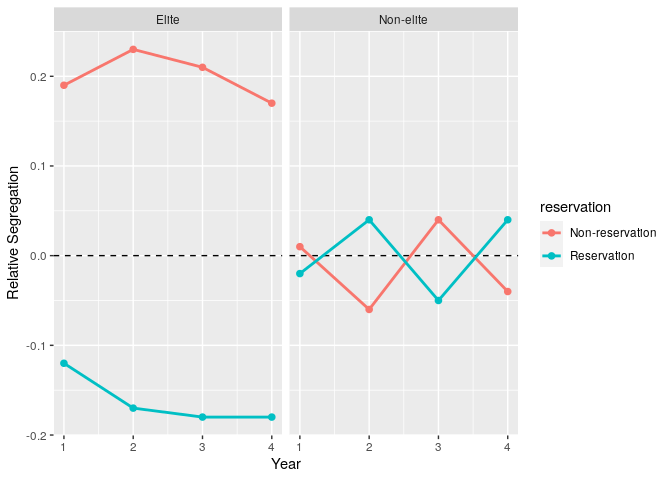<!-- -->
