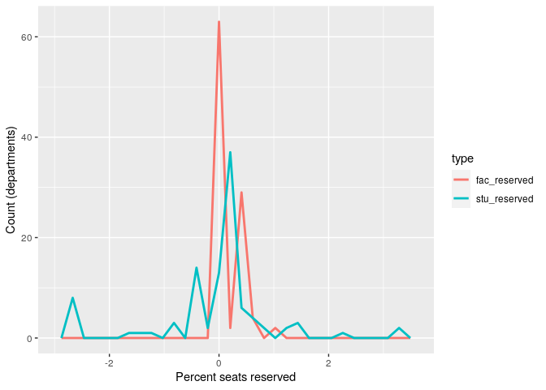

Analysis for SN Paper 1 - Inference
================
Saurabh Khanna
2020-03-31

  - [Integration v Policy](#integration-v-policy)
      - [Y1 to Y2](#y1-to-y2)
      - [Y3 to Y4](#y3-to-y4)
      - [Elite (Y1 to Y2)](#elite-y1-to-y2)
      - [Elite (Y3 to Y4)](#elite-y3-to-y4)
      - [Non-elite (Y1 to Y2)](#non-elite-y1-to-y2)
      - [Non-elite (Y3 to Y4)](#non-elite-y3-to-y4)
  - [Reciprocity v Policy](#reciprocity-v-policy)

``` r
# Libraries
library(tidyverse)
library(haven)
library(stargazer)
library(AER)
library(sandwich)
library(lmtest)

# Parameters
data_file <- here::here("data/stu_admin_all_with_netvars.Rds")
trends_file <- here::here("data/trends.csv")
```

Read main data file:

``` r
df <-
  data_file %>%
  read_rds() %>% 
  filter(stu_merge == 3) %>% 
  mutate_at(vars(contains("ea_seats_reser")), replace_na, replace = 0) %>% 
  mutate(
    female = gender - 1,
    age = 2017 - lubridate::year(b_birthdate),
    reservation = dplyr::recode(reservation, "Non-reservation" = 0L, "Reservation" = 1L, .default = NA_integer_),
    stu_reserved = (ea_seats_reserved_students_obc + ea_seats_reserved_students_sc + ea_seats_reserved_students_st) / 100,
    fac_reserved = (ea_seats_reserved_faculty_obc + ea_seats_reserved_faculty_sc + ea_seats_reserved_faculty_st) / 100,
    z_seg_g1 = if_else(grade == 2, b_seg_studymate, NA_real_),
    z_seg_g2 = if_else(grade == 2, e_seg_studymate, NA_real_),
    z_seg_g3 = if_else(grade == 4, b_seg_studymate, NA_real_),
    z_seg_g4 = if_else(grade == 4, e_seg_studymate, NA_real_)
  )

df <-
  df %>% 
  left_join(
    df %>% 
      group_by(classid) %>% 
      summarize(stu_res_prop = mean(reservation, na.rm = TRUE)),
    by = "classid"
  ) %>% 
  mutate_at(
    vars(starts_with("z_seg_g"), stu_res_prop, age, stu_reserved),
    ~ scale(.) %>% as.vector
  )

df %>% 
  select(starts_with("z_seg_g"), stu_res_prop, age, stu_reserved) %>% 
  summary()
```

    ##     z_seg_g1         z_seg_g2         z_seg_g3         z_seg_g4     
    ##  Min.   :-2.139   Min.   :-2.383   Min.   :-2.304   Min.   :-2.372  
    ##  1st Qu.:-0.688   1st Qu.:-0.750   1st Qu.:-0.719   1st Qu.:-0.736  
    ##  Median : 0.037   Median : 0.067   Median : 0.073   Median : 0.083  
    ##  Mean   : 0.000   Mean   : 0.000   Mean   : 0.000   Mean   : 0.000  
    ##  3rd Qu.: 0.762   3rd Qu.: 0.793   3rd Qu.: 0.777   3rd Qu.: 0.810  
    ##  Max.   : 1.487   Max.   : 1.700   Max.   : 1.658   Max.   : 1.720  
    ##  NA's   :9166     NA's   :9012     NA's   :7982     NA's   :8036    
    ##   stu_res_prop           age            stu_reserved    
    ##  Min.   :-3.16936   Min.   :-2.86187   Min.   :-2.7480  
    ##  1st Qu.:-0.36276   1st Qu.:-0.70296   1st Qu.:-0.4253  
    ##  Median : 0.02606   Median : 0.01667   Median : 0.1702  
    ##  Mean   : 0.00000   Mean   : 0.00000   Mean   : 0.0000  
    ##  3rd Qu.: 0.63758   3rd Qu.: 0.73631   3rd Qu.: 0.2298  
    ##  Max.   : 3.04196   Max.   :11.53086   Max.   : 3.2075  
    ##                     NA's   :154

``` r
df %>% 
  lm(ea_polic_integration_students3 ~ stu_res_prop + z_seg_g1 + female + age + ses + stu_reserved + reservation + elite, data = .) %>%
  linearHypothesis(c("stu_res_prop = 0"), vcov = vcovHC, type = "HC1")
```

    ## Linear hypothesis test
    ## 
    ## Hypothesis:
    ## stu_res_prop = 0
    ## 
    ## Model 1: restricted model
    ## Model 2: ea_polic_integration_students3 ~ stu_res_prop + z_seg_g1 + female + 
    ##     age + ses + stu_reserved + reservation + elite
    ## 
    ## Note: Coefficient covariance matrix supplied.
    ## 
    ##   Res.Df Df      F  Pr(>F)  
    ## 1   6707                    
    ## 2   6706  1 5.5961 0.01803 *
    ## ---
    ## Signif. codes:  0 '***' 0.001 '**' 0.01 '*' 0.05 '.' 0.1 ' ' 1

## Integration v Policy

### Y1 to Y2

``` r
lm1_r <- 
  lm(
    z_seg_g2 ~ z_seg_g1 + female + age + ses + stu_reserved, 
    data = df %>% filter(reservation == 1)
  )

lm1_nr <- 
  lm(
    z_seg_g2 ~ z_seg_g1 + female + age + ses + stu_reserved, 
    data = df %>% filter(reservation == 0)
  )

lm2_r <- 
  ivreg(
    z_seg_g2 ~ z_seg_g1 + female + age + ses + stu_reserved + ea_polic_integration_students2
    | . - ea_polic_integration_students2 + stu_res_prop, 
    data = df %>% filter(reservation == 1)
  )

lm2_nr <- 
  ivreg(
    z_seg_g2 ~ z_seg_g1 + female + age + ses + stu_reserved + ea_polic_integration_students2
    | . - ea_polic_integration_students2 + stu_res_prop,
    data = df %>% filter(reservation == 0)
  )

lm3_r <- 
  ivreg(
    z_seg_g2 ~ z_seg_g1 + female + age + ses + stu_reserved + ea_polic_integration_students4 
    | . - ea_polic_integration_students4 + stu_res_prop, 
    data = df %>% filter(reservation == 1)
  )

lm3_nr <- 
  ivreg(
    z_seg_g2 ~ z_seg_g1 + female + age + ses + stu_reserved + ea_polic_integration_students4 
    | . - ea_polic_integration_students4 + stu_res_prop,
    data = df %>% filter(reservation == 0)
  )

lm4_r <- 
  ivreg(
    z_seg_g2 ~ z_seg_g1 + female + age + ses + stu_reserved + ea_polic_integration_students5
    | . - ea_polic_integration_students5 + stu_res_prop, 
    data = df %>% filter(reservation == 1)
  )

lm4_nr <- 
  ivreg(
    z_seg_g2 ~ z_seg_g1 + female + age + ses + stu_reserved + ea_polic_integration_students5 
    | . - ea_polic_integration_students5 + stu_res_prop,
    data = df %>% filter(reservation == 0)
  )

lm5_r <- 
  ivreg(
    z_seg_g2 ~ z_seg_g1 + female + age + ses + stu_reserved + ea_polic_integration_students6
    | . - ea_polic_integration_students6 + stu_res_prop, 
    data = df %>% filter(reservation == 1)
  )

lm5_nr <- 
  ivreg(
    z_seg_g2 ~ z_seg_g1 + female + age + ses + stu_reserved + ea_polic_integration_students6
    | . - ea_polic_integration_students6 + stu_res_prop, 
    data = df %>% filter(reservation == 0)
  )

rob_se <- 
  list(
    sqrt(diag(vcovHC(lm1_r, type = "HC1"))),
    sqrt(diag(vcovHC(lm1_nr, type = "HC1"))),
    sqrt(diag(vcovHC(lm2_r, type = "HC1"))),
    sqrt(diag(vcovHC(lm2_nr, type = "HC1"))),
    sqrt(diag(vcovHC(lm3_r, type = "HC1"))),
    sqrt(diag(vcovHC(lm3_nr, type = "HC1"))),
    sqrt(diag(vcovHC(lm4_r, type = "HC1"))),
    sqrt(diag(vcovHC(lm4_nr, type = "HC1"))),
    sqrt(diag(vcovHC(lm5_r, type = "HC1"))),
    sqrt(diag(vcovHC(lm5_nr, type = "HC1")))
  )

stargazer(
  lm1_r, lm1_nr, lm2_r, lm2_nr, lm3_r, lm3_nr, lm4_r, lm4_nr, lm5_r, lm5_nr,
  se = rob_se,
  header = F,
  digits = 3,
  model.numbers = F,
  dep.var.caption  = "Segregation - End of year 2 (by student reservation status)",
  dep.var.labels.include  = F,
  column.labels   = c("Reservation", "Non-reservation", "Reservation", "Non-reservation", "Reservation", "Non-reservation", "Reservation", "Non-reservation", "Reservation", "Non-reservation"),
  covariate.labels = c("Segregation - Start of year 1", "Extracurricular activities", "Diverse hostels", "Diverse course sections", "Integration courses", "Constant"),
  keep = c("z_seg", "ea_", "Constant"),
  keep.stat = c("n", "ser"),
  type = "html",
  out = "testing.html",
  notes = c(
    "All models control for <i>proportion of seats reserved, student gender, socioeconomic status,</i> and <i>age</i>.",
    "Instrument: Proportion of reservation students in each department-year."
  )
)
```

### Y3 to Y4

``` r
lm1_r <- 
  lm(
    z_seg_g4 ~ z_seg_g3 + female + age + ses + stu_reserved, 
    data = df %>% filter(reservation == 1)
  )

lm1_nr <- 
  lm(
    z_seg_g4 ~ z_seg_g3 + female + age + ses + stu_reserved, 
    data = df %>% filter(reservation == 0)
  )

lm2_r <- 
  ivreg(
    z_seg_g4 ~ z_seg_g3 + female + age + ses + stu_reserved + ea_polic_integration_students2
    | . - ea_polic_integration_students2 + stu_res_prop, 
    data = df %>% filter(reservation == 1)
  )

lm2_nr <- 
  ivreg(
    z_seg_g4 ~ z_seg_g3 + female + age + ses + stu_reserved + ea_polic_integration_students2
    | . - ea_polic_integration_students2 + stu_res_prop,
    data = df %>% filter(reservation == 0)
  )

lm3_r <- 
  ivreg(
    z_seg_g4 ~ z_seg_g3 + female + age + ses + stu_reserved + ea_polic_integration_students4 
    | . - ea_polic_integration_students4 + stu_res_prop, 
    data = df %>% filter(reservation == 1)
  )

lm3_nr <- 
  ivreg(
    z_seg_g4 ~ z_seg_g3 + female + age + ses + stu_reserved + ea_polic_integration_students4 
    | . - ea_polic_integration_students4 + stu_res_prop,
    data = df %>% filter(reservation == 0)
  )

lm4_r <- 
  ivreg(
    z_seg_g4 ~ z_seg_g3 + female + age + ses + stu_reserved + ea_polic_integration_students5
    | . - ea_polic_integration_students5 + stu_res_prop, 
    data = df %>% filter(reservation == 1)
  )

lm4_nr <- 
  ivreg(
    z_seg_g4 ~ z_seg_g3 + female + age + ses + stu_reserved + ea_polic_integration_students5 
    | . - ea_polic_integration_students5 + stu_res_prop,
    data = df %>% filter(reservation == 0)
  )

lm5_r <- 
  ivreg(
    z_seg_g4 ~ z_seg_g3 + female + age + ses + stu_reserved + ea_polic_integration_students6
    | . - ea_polic_integration_students6 + stu_res_prop, 
    data = df %>% filter(reservation == 1)
  )

lm5_nr <- 
  ivreg(
    z_seg_g4 ~ z_seg_g3 + female + age + ses + stu_reserved + ea_polic_integration_students6
    | . - ea_polic_integration_students6 + stu_res_prop, 
    data = df %>% filter(reservation == 0)
  )

rob_se <- 
  list(
    sqrt(diag(vcovHC(lm1_r, type = "HC1"))),
    sqrt(diag(vcovHC(lm1_nr, type = "HC1"))),
    sqrt(diag(vcovHC(lm2_r, type = "HC1"))),
    sqrt(diag(vcovHC(lm2_nr, type = "HC1"))),
    sqrt(diag(vcovHC(lm3_r, type = "HC1"))),
    sqrt(diag(vcovHC(lm3_nr, type = "HC1"))),
    sqrt(diag(vcovHC(lm4_r, type = "HC1"))),
    sqrt(diag(vcovHC(lm4_nr, type = "HC1"))),
    sqrt(diag(vcovHC(lm5_r, type = "HC1"))),
    sqrt(diag(vcovHC(lm5_nr, type = "HC1")))
  )

stargazer(
  lm1_r, lm1_nr, lm2_r, lm2_nr, lm3_r, lm3_nr, lm4_r, lm4_nr, lm5_r, lm5_nr,
  se = rob_se,
  header = F,
  digits = 3,
  model.numbers = F,
  dep.var.caption  = "Segregation - End of year 4 (by student reservation status)",
  dep.var.labels.include  = F,
  column.labels   = c("Reservation", "Non-reservation", "Reservation", "Non-reservation", "Reservation", "Non-reservation", "Reservation", "Non-reservation", "Reservation", "Non-reservation"),
  covariate.labels = c("Segregation - Start of year 3", "Extracurricular activities", "Diverse hostels", "Diverse course sections", "Integration courses", "Constant"),
  keep = c("z_seg", "ea_", "Constant"),
  keep.stat = c("n", "ser"),
  type = "html",
  out = "testing.html",
  notes = c(
    "All models control for proportion of seats reserved, student gender, socioeconomic status, and age.",
    "Instrument: Proportion of reservation students in each department-year."
  )
)
```

### Elite (Y1 to Y2)

``` r
lm1_r <- 
  lm(
    z_seg_g2 ~ z_seg_g1 + female + age + ses, 
    data = df %>% filter(reservation == 1, elite == 1)
  )

lm1_nr <- 
  lm(
    z_seg_g2 ~ z_seg_g1 + female + age + ses, 
    data = df %>% filter(reservation == 0, elite == 1)
  )

lm2_r <- 
  lm(
    z_seg_g2 ~ z_seg_g1 + female + age + ses + stu_reserved, 
    data = df %>% filter(reservation == 1, elite == 1)
  )

lm2_nr <- 
  lm(
    z_seg_g2 ~ z_seg_g1 + female + age + ses + stu_reserved, 
    data = df %>% filter(reservation == 0, elite == 1)
  )

lm3_r <- 
  lm(
    z_seg_g2 ~ z_seg_g1 + female + age + ses + stu_reserved + ea_polic_integration_students4, 
    data = df %>% filter(reservation == 1, elite == 1)
  )

lm3_nr <- 
  lm(
    z_seg_g2 ~ z_seg_g1 + female + age + ses + stu_reserved + ea_polic_integration_students4,
    data = df %>% filter(reservation == 0, elite == 1)
  )

lm4_r <- 
  lm(
    z_seg_g2 ~ z_seg_g1 + female + age + ses + stu_reserved + ea_polic_integration_students4 + ea_polic_integration_students5,
    data = df %>% filter(reservation == 1, elite == 1)
  )

lm4_nr <- 
  lm(
    z_seg_g2 ~ z_seg_g1 + female + age + ses + stu_reserved + ea_polic_integration_students4 + ea_polic_integration_students5,
    data = df %>% filter(reservation == 0, elite == 1)
  )

lm5_r <- 
  lm(
    z_seg_g2 ~ z_seg_g1 + female + age + ses + stu_reserved + ea_polic_integration_students4 + ea_polic_integration_students5 + ea_polic_integration_students6, 
    data = df %>% filter(reservation == 1, elite == 1)
  )

lm5_nr <- 
  lm(
    z_seg_g2 ~ z_seg_g1 + female + age + ses + stu_reserved + ea_polic_integration_students4 + ea_polic_integration_students5 + ea_polic_integration_students6, 
    data = df %>% filter(reservation == 0, elite == 1)
  )

rob_se <- 
  list(
    sqrt(diag(vcovHC(lm1_r, type = "HC1"))),
    sqrt(diag(vcovHC(lm1_nr, type = "HC1"))),
    sqrt(diag(vcovHC(lm2_r, type = "HC1"))),
    sqrt(diag(vcovHC(lm2_nr, type = "HC1"))),
    sqrt(diag(vcovHC(lm3_r, type = "HC1"))),
    sqrt(diag(vcovHC(lm3_nr, type = "HC1"))),
    sqrt(diag(vcovHC(lm4_r, type = "HC1"))),
    sqrt(diag(vcovHC(lm4_nr, type = "HC1"))),
    sqrt(diag(vcovHC(lm5_r, type = "HC1"))),
    sqrt(diag(vcovHC(lm5_nr, type = "HC1")))
  )

stargazer(
  lm1_r, lm1_nr, lm2_r, lm2_nr, lm3_r, lm3_nr, lm4_r, lm4_nr, lm5_r, lm5_nr,
  se = rob_se,
  header = F,
  digits = 3,
  model.numbers = F,
  dep.var.caption  = "Segregation at <i>elite</i> colleges - End of year 2",
  dep.var.labels  = "Student reservation status",
  column.labels   = c("Reservation", "Non-reservation", "Reservation", "Non-reservation", "Reservation", "Non-reservation", "Reservation", "Non-reservation", "Reservation", "Non-reservation"),
  covariate.labels = c("Segregation - Start of year 1", "Proportion of student seats reserved", "Diverse hostels", "Diverse course sections", "Integration courses taught", "Constant"),
  keep = c("z_seg", "stu_", "ea_", "Constant"),
  type = "html",
  out = "testing.html",
  notes = "All models control for student gender, socioeconomic status, and age.",
  omit.table.layout = "sn"
)
```

### Elite (Y3 to Y4)

``` r
lm1_r <- 
  lm(
    z_seg_g4 ~ z_seg_g3 + female + age + ses, 
    data = df %>% filter(reservation == 1, elite == 1)
  )

lm1_nr <- 
  lm(
    z_seg_g4 ~ z_seg_g3 + female + age + ses, 
    data = df %>% filter(reservation == 0, elite == 1)
  )

lm2_r <- 
  lm(
    z_seg_g4 ~ z_seg_g3 + female + age + ses + stu_reserved, 
    data = df %>% filter(reservation == 1, elite == 1)
  )

lm2_nr <- 
  lm(
    z_seg_g4 ~ z_seg_g3 + female + age + ses + stu_reserved, 
    data = df %>% filter(reservation == 0, elite == 1)
  )

lm3_r <- 
  lm(
    z_seg_g4 ~ z_seg_g3 + female + age + ses + stu_reserved + ea_polic_integration_students4, 
    data = df %>% filter(reservation == 1, elite == 1)
  )

lm3_nr <- 
  lm(
    z_seg_g4 ~ z_seg_g3 + female + age + ses + stu_reserved + ea_polic_integration_students4,
    data = df %>% filter(reservation == 0, elite == 1)
  )

lm4_r <- 
  lm(
    z_seg_g4 ~ z_seg_g3 + female + age + ses + stu_reserved + ea_polic_integration_students4 + ea_polic_integration_students5,
    data = df %>% filter(reservation == 1, elite == 1)
  )

lm4_nr <- 
  lm(
    z_seg_g4 ~ z_seg_g3 + female + age + ses + stu_reserved + ea_polic_integration_students4 + ea_polic_integration_students5,
    data = df %>% filter(reservation == 0, elite == 1)
  )

lm5_r <- 
  lm(
    z_seg_g4 ~ z_seg_g3 + female + age + ses + stu_reserved + ea_polic_integration_students4 + ea_polic_integration_students5 + ea_polic_integration_students6, 
    data = df %>% filter(reservation == 1, elite == 1)
  )

lm5_nr <- 
  lm(
    z_seg_g4 ~ z_seg_g3 + female + age + ses + stu_reserved + ea_polic_integration_students4 + ea_polic_integration_students5 + ea_polic_integration_students6, 
    data = df %>% filter(reservation == 0, elite == 1)
  )

rob_se <- 
  list(
    sqrt(diag(vcovHC(lm1_r, type = "HC1"))),
    sqrt(diag(vcovHC(lm1_nr, type = "HC1"))),
    sqrt(diag(vcovHC(lm2_r, type = "HC1"))),
    sqrt(diag(vcovHC(lm2_nr, type = "HC1"))),
    sqrt(diag(vcovHC(lm3_r, type = "HC1"))),
    sqrt(diag(vcovHC(lm3_nr, type = "HC1"))),
    sqrt(diag(vcovHC(lm4_r, type = "HC1"))),
    sqrt(diag(vcovHC(lm4_nr, type = "HC1"))),
    sqrt(diag(vcovHC(lm5_r, type = "HC1"))),
    sqrt(diag(vcovHC(lm5_nr, type = "HC1")))
  )

stargazer(
  lm1_r, lm1_nr, lm2_r, lm2_nr, lm3_r, lm3_nr, lm4_r, lm4_nr, lm5_r, lm5_nr,
  se = rob_se,
  header = F,
  digits = 3,
  model.numbers = F,
  dep.var.caption  = "Segregation at <i>elite</i> colleges - End of year 4",
  dep.var.labels  = "Student reservation status",
  column.labels   = c("Reservation", "Non-reservation", "Reservation", "Non-reservation", "Reservation", "Non-reservation", "Reservation", "Non-reservation", "Reservation", "Non-reservation"),
  covariate.labels = c("Segregation - Start of year 3", "Proportion of student seats reserved", "Diverse hostels", "Diverse course sections", "Integration courses taught", "Constant"),
  keep = c("z_seg", "stu_", "ea_", "Constant"),
  type = "html",
  out = "testing.html",
  notes = "All models control for student gender, socioeconomic status, and age.",
  omit.table.layout = "sn"
)
```

### Non-elite (Y1 to Y2)

``` r
lm1_r <- 
  lm(
    z_seg_g2 ~ z_seg_g1 + female + age + ses, 
    data = df %>% filter(reservation == 1, elite == 0)
  )

lm1_nr <- 
  lm(
    z_seg_g2 ~ z_seg_g1 + female + age + ses, 
    data = df %>% filter(reservation == 0, elite == 0)
  )

lm2_r <- 
  lm(
    z_seg_g2 ~ z_seg_g1 + female + age + ses + stu_reserved, 
    data = df %>% filter(reservation == 1, elite == 0)
  )

lm2_nr <- 
  lm(
    z_seg_g2 ~ z_seg_g1 + female + age + ses + stu_reserved, 
    data = df %>% filter(reservation == 0, elite == 0)
  )

lm3_r <- 
  lm(
    z_seg_g2 ~ z_seg_g1 + female + age + ses + stu_reserved + ea_polic_integration_students4, 
    data = df %>% filter(reservation == 1, elite == 0)
  )

lm3_nr <- 
  lm(
    z_seg_g2 ~ z_seg_g1 + female + age + ses + stu_reserved + ea_polic_integration_students4,
    data = df %>% filter(reservation == 0, elite == 0)
  )

lm4_r <- 
  lm(
    z_seg_g2 ~ z_seg_g1 + female + age + ses + stu_reserved + ea_polic_integration_students4 + ea_polic_integration_students5,
    data = df %>% filter(reservation == 1, elite == 0)
  )

lm4_nr <- 
  lm(
    z_seg_g2 ~ z_seg_g1 + female + age + ses + stu_reserved + ea_polic_integration_students4 + ea_polic_integration_students5,
    data = df %>% filter(reservation == 0, elite == 0)
  )

lm5_r <- 
  lm(
    z_seg_g2 ~ z_seg_g1 + female + age + ses + stu_reserved + ea_polic_integration_students4 + ea_polic_integration_students5 + ea_polic_integration_students6, 
    data = df %>% filter(reservation == 1, elite == 0)
  )

lm5_nr <- 
  lm(
    z_seg_g2 ~ z_seg_g1 + female + age + ses + stu_reserved + ea_polic_integration_students4 + ea_polic_integration_students5 + ea_polic_integration_students6, 
    data = df %>% filter(reservation == 0, elite == 0)
  )

rob_se <- 
  list(
    sqrt(diag(vcovHC(lm1_r, type = "HC1"))),
    sqrt(diag(vcovHC(lm1_nr, type = "HC1"))),
    sqrt(diag(vcovHC(lm2_r, type = "HC1"))),
    sqrt(diag(vcovHC(lm2_nr, type = "HC1"))),
    sqrt(diag(vcovHC(lm3_r, type = "HC1"))),
    sqrt(diag(vcovHC(lm3_nr, type = "HC1"))),
    sqrt(diag(vcovHC(lm4_r, type = "HC1"))),
    sqrt(diag(vcovHC(lm4_nr, type = "HC1"))),
    sqrt(diag(vcovHC(lm5_r, type = "HC1"))),
    sqrt(diag(vcovHC(lm5_nr, type = "HC1")))
  )

stargazer(
  lm1_r, lm1_nr, lm2_r, lm2_nr, lm3_r, lm3_nr, lm4_r, lm4_nr, lm5_r, lm5_nr,
  se = rob_se,
  header = F,
  digits = 3,
  model.numbers = F,
  dep.var.caption  = "Segregation at <i>non-elite</i> colleges - End of year 2",
  dep.var.labels  = "Student reservation status",
  column.labels   = c("Reservation", "Non-reservation", "Reservation", "Non-reservation", "Reservation", "Non-reservation", "Reservation", "Non-reservation", "Reservation", "Non-reservation"),
  covariate.labels = c("Segregation - Start of year 1", "Proportion of student seats reserved", "Diverse hostels", "Diverse course sections", "Integration courses taught", "Constant"),
  keep = c("z_seg", "stu_", "ea_", "Constant"),
  type = "html",
  out = "testing.html",
  notes = "All models control for student gender, socioeconomic status, and age.",
  omit.table.layout = "sn"
)
```

### Non-elite (Y3 to Y4)

``` r
lm1_r <- 
  lm(
    z_seg_g4 ~ z_seg_g3 + female + age + ses, 
    data = df %>% filter(reservation == 1, elite == 0)
  )

lm1_nr <- 
  lm(
    z_seg_g4 ~ z_seg_g3 + female + age + ses, 
    data = df %>% filter(reservation == 0, elite == 0)
  )

lm2_r <- 
  lm(
    z_seg_g4 ~ z_seg_g3 + female + age + ses + stu_reserved, 
    data = df %>% filter(reservation == 1, elite == 0)
  )

lm2_nr <- 
  lm(
    z_seg_g4 ~ z_seg_g3 + female + age + ses + stu_reserved, 
    data = df %>% filter(reservation == 0, elite == 0)
  )

lm3_r <- 
  lm(
    z_seg_g4 ~ z_seg_g3 + female + age + ses + stu_reserved + ea_polic_integration_students4, 
    data = df %>% filter(reservation == 1, elite == 0)
  )

lm3_nr <- 
  lm(
    z_seg_g4 ~ z_seg_g3 + female + age + ses + stu_reserved + ea_polic_integration_students4,
    data = df %>% filter(reservation == 0, elite == 0)
  )

lm4_r <- 
  lm(
    z_seg_g4 ~ z_seg_g3 + female + age + ses + stu_reserved + ea_polic_integration_students4 + ea_polic_integration_students5,
    data = df %>% filter(reservation == 1, elite == 0)
  )

lm4_nr <- 
  lm(
    z_seg_g4 ~ z_seg_g3 + female + age + ses + stu_reserved + ea_polic_integration_students4 + ea_polic_integration_students5,
    data = df %>% filter(reservation == 0, elite == 0)
  )

lm5_r <- 
  lm(
    z_seg_g4 ~ z_seg_g3 + female + age + ses + stu_reserved + ea_polic_integration_students4 + ea_polic_integration_students5 + ea_polic_integration_students6, 
    data = df %>% filter(reservation == 1, elite == 0)
  )

lm5_nr <- 
  lm(
    z_seg_g4 ~ z_seg_g3 + female + age + ses + stu_reserved + ea_polic_integration_students4 + ea_polic_integration_students5 + ea_polic_integration_students6, 
    data = df %>% filter(reservation == 0, elite == 0)
  )

rob_se <- 
  list(
    sqrt(diag(vcovHC(lm1_r, type = "HC1"))),
    sqrt(diag(vcovHC(lm1_nr, type = "HC1"))),
    sqrt(diag(vcovHC(lm2_r, type = "HC1"))),
    sqrt(diag(vcovHC(lm2_nr, type = "HC1"))),
    sqrt(diag(vcovHC(lm3_r, type = "HC1"))),
    sqrt(diag(vcovHC(lm3_nr, type = "HC1"))),
    sqrt(diag(vcovHC(lm4_r, type = "HC1"))),
    sqrt(diag(vcovHC(lm4_nr, type = "HC1"))),
    sqrt(diag(vcovHC(lm5_r, type = "HC1"))),
    sqrt(diag(vcovHC(lm5_nr, type = "HC1")))
  )

stargazer(
  lm1_r, lm1_nr, lm2_r, lm2_nr, lm3_r, lm3_nr, lm4_r, lm4_nr, lm5_r, lm5_nr,
  se = rob_se,
  header = F,
  digits = 3,
  model.numbers = F,
  dep.var.caption  = "Segregation at <i>non-elite</i> colleges - End of year 4",
  dep.var.labels  = "Student reservation status",
  column.labels   = c("Reservation", "Non-reservation", "Reservation", "Non-reservation", "Reservation", "Non-reservation", "Reservation", "Non-reservation", "Reservation", "Non-reservation"),
  covariate.labels = c("Segregation - Start of year 3", "Proportion of student seats reserved", "Diverse hostels", "Diverse course sections", "Integration courses taught", "Constant"),
  keep = c("z_seg", "stu_", "ea_", "Constant"),
  type = "html",
  out = "testing.html",
  notes = "All models control for student gender, socioeconomic status, and age.",
  omit.table.layout = "sn"
)
```

## Reciprocity v Policy

``` r
df %>%
  mutate(
    z_reciprocity_g1 = if_else(grade == 2, b_reciprocity, NA_real_),
    z_reciprocity_g2 = if_else(grade == 2, e_reciprocity, NA_real_),
    z_reciprocity_g3 = if_else(grade == 4, b_reciprocity, NA_real_),
    z_reciprocity_g4 = if_else(grade == 4, e_reciprocity, NA_real_)
  ) %>%
  group_by(department_id) %>% 
  mutate_at(vars(starts_with("z_reciprocity")), mean, na.rm = T) %>% 
  ungroup() %>% 
  distinct(department_id, .keep_all = TRUE) %>% 
  #distinct(classid, .keep_all = TRUE) %>% 
  # mutate_at(
  #   vars(starts_with("z_reciprocity")),
  #   ~ scale(.) %>% as.vector
  # ) %>%
  # filter(reservation == 1) %>% 
  select(department_id, starts_with("z_reciprocity"))
```

    ## # A tibble: 100 x 5
    ##    department_id z_reciprocity_g1 z_reciprocity_g2 z_reciprocity_g3
    ##    <chr>                    <dbl>            <dbl>            <dbl>
    ##  1 IR001CS                  0.435            0.428            0.411
    ##  2 IR001EE                  0.310            0.356            0.48 
    ##  3 IR002CS                  0.440            0.422            0.463
    ##  4 IR002EE                  0.457            0.432            0.436
    ##  5 IR003CS                  0.414            0.304            0.435
    ##  6 IR003EE                  0.372            0.352            0.399
    ##  7 IR004CS                  0.472            0.448            0.423
    ##  8 IR004EE                  0.727            0.778            0.556
    ##  9 IR005CS                  0.470            0.465            0.473
    ## 10 IR005EE                  0.384            0.416            0.481
    ## # … with 90 more rows, and 1 more variable: z_reciprocity_g4 <dbl>

``` r
df %>% 
  distinct(department_id, .keep_all = T) %>% 
  select(department_id, stu_reserved, fac_reserved) %>% 
  pivot_longer(
    cols = -department_id,
    names_to = "type",
    values_to = "percent"
  ) %>% 
  ggplot(aes(percent, stat(count), color = type)) +
  geom_freqpoly(size = 1) +
  labs(
    x = "Percent seats reserved",
    y = "Count (departments)"
  )
```

    ## `stat_bin()` using `bins = 30`. Pick better value with `binwidth`.

<!-- -->

``` r
df %>% 
  lm(b_seg_studymate ~ stu_reserved, data = .) %>% 
  summary()
```

    ## 
    ## Call:
    ## lm(formula = b_seg_studymate ~ stu_reserved, data = .)
    ## 
    ## Residuals:
    ##      Min       1Q   Median       3Q      Max 
    ## -0.60018 -0.18403  0.01468  0.19375  0.43212 
    ## 
    ## Coefficients:
    ##               Estimate Std. Error t value Pr(>|t|)    
    ## (Intercept)   0.585275   0.002169 269.793   <2e-16 ***
    ## stu_reserved -0.005423   0.002227  -2.435   0.0149 *  
    ## ---
    ## Signif. codes:  0 '***' 0.001 '**' 0.01 '*' 0.05 '.' 0.1 ' ' 1
    ## 
    ## Residual standard error: 0.2634 on 14750 degrees of freedom
    ##   (1198 observations deleted due to missingness)
    ## Multiple R-squared:  0.0004017,  Adjusted R-squared:  0.0003339 
    ## F-statistic: 5.927 on 1 and 14750 DF,  p-value: 0.01492

``` r
cor(df$b_seg_studymate, df$stu_reserved, use = "complete.obs")
```

    ## [1] -0.02004244
