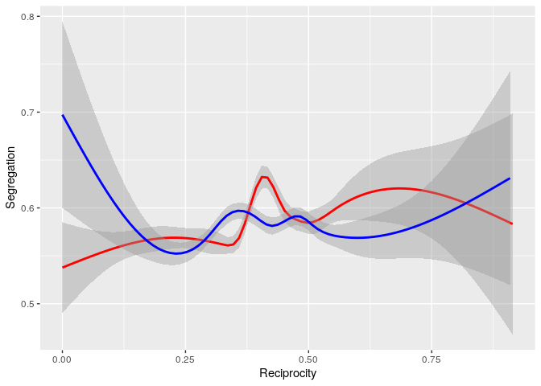
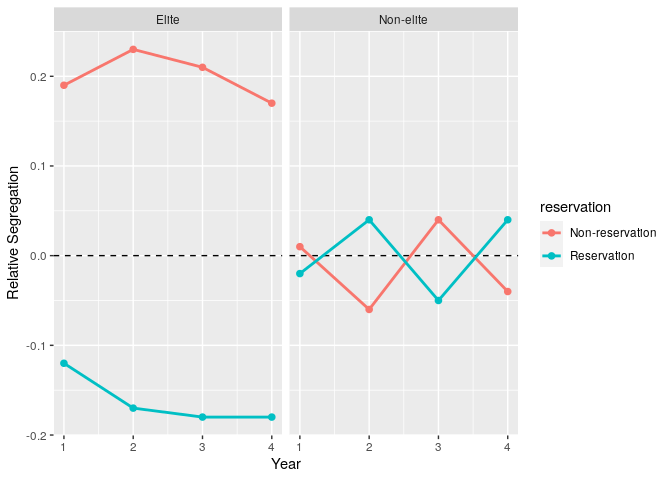

Analysis for SN Paper 1 - Inference
================
Saurabh Khanna
2020-03-25

``` r
# Libraries
library(tidyverse)
library(haven)
library(stargazer)
library(plm)
library(sandwich)
library(lmtest)

# Parameters
data_file <- here::here("data/stu_admin_all_with_netvars.Rds")
trends_file <- here::here("data/trends.csv")
```

Read main data file:

``` r
df <-
  data_file %>%
  read_rds()
```

Student fixed effects:

``` r
df %>% 
  pivot_longer(
    cols = contains("_seg_studymate"),
    names_to = "survey",
    values_to = "seg_studymate",
    values_drop_na = FALSE
  ) %>%
  transmute(
    stdid, 
    endline = 
      recode(
        survey, 
        "b_seg_studymate" = "0",
        "e_seg_studymate" = "1"
      ) %>% 
      as.integer(), 
    seg_studymate
  ) %>% 
  left_join(
    df %>% 
      pivot_longer(
        cols = ends_with("ql_score"),
        names_to = "endline",
        values_to = "ql_score",
        values_drop_na = FALSE
      ) %>%
      mutate(
        stdid, 
        endline = 
          recode(
            endline, 
            "b_ql_score" = "0",
            "e_ql_score" = "1"
          ) %>% 
          as.integer(), 
        ql_score
      ),
    by = c("stdid", "endline")
  ) %>% 
  filter(stu_merge == 3) %>%
  plm(
    ql_score ~ seg_studymate,
    data = .,
    index = c("stdid", "endline"),
    model = "within"
  ) %>% 
  coeftest(vcov. = vcovHC, type = "HC1")
```

    ## 
    ## t test of coefficients:
    ## 
    ##               Estimate Std. Error t value Pr(>|t|)
    ## seg_studymate -0.18383    0.34560 -0.5319   0.5948

OLD ANALYSES:

Relationship between transitivity/reciprocity and integration scores:

``` r
df %>% 
  filter(elite == 0) %>% 
  ggplot() +
  geom_smooth(aes(b_reciprocity, b_seg_studymate), color = "red") +
  geom_smooth(aes(e_reciprocity, e_seg_studymate), color = "blue") +
  labs(
    x = "Reciprocity",
    y = "Segregation"
  )
```

    ## `geom_smooth()` using method = 'gam' and formula 'y ~ s(x, bs = "cs")'

    ## Warning: Removed 3534 rows containing non-finite values (stat_smooth).

    ## `geom_smooth()` using method = 'gam' and formula 'y ~ s(x, bs = "cs")'

    ## Warning: Removed 2646 rows containing non-finite values (stat_smooth).

<!-- -->

Segregation gain across years:

``` r
df %>% 
  select(classid, stdid, grade, elite, reservation, contains("_seg_stud")) %>% 
  filter(grade == 2) %>% 
  pivot_longer(
    cols = contains("_seg_"),
    names_to = "endline",
    values_to = "segregation"
  ) %>% 
  mutate(
    endline = recode(endline, "b_seg_studymate" = "0", "e_seg_studymate" = "1") %>% parse_integer(),
    reservation = recode(reservation, "Non-reservation" = "0", "Reservation" = "1") %>% parse_integer(),
    segregation = scale(segregation)
  ) %>%
  arrange(classid, stdid) %>% 
  filter(reservation == 0, elite == 0) %>% 
  lm(segregation ~ factor(endline), data = .) %>% 
  summary()
```

    ## 
    ## Call:
    ## lm(formula = segregation ~ factor(endline), data = .)
    ## 
    ## Residuals:
    ##      Min       1Q   Median       3Q      Max 
    ## -2.28338 -0.64456  0.02251  0.79114  1.66133 
    ## 
    ## Coefficients:
    ##                  Estimate Std. Error t value Pr(>|t|)    
    ## (Intercept)       0.03096    0.01792   1.728    0.084 .  
    ## factor(endline)1 -0.10157    0.02461  -4.127 3.73e-05 ***
    ## ---
    ## Signif. codes:  0 '***' 0.001 '**' 0.01 '*' 0.05 '.' 0.1 ' ' 1
    ## 
    ## Residual standard error: 0.9898 on 6491 degrees of freedom
    ##   (1457 observations deleted due to missingness)
    ## Multiple R-squared:  0.002617,   Adjusted R-squared:  0.002463 
    ## F-statistic: 17.03 on 1 and 6491 DF,  p-value: 3.726e-05

``` r
df %>% 
  select(classid, stdid, grade, elite, reservation, contains("_seg_stud")) %>% 
  filter(grade == 4) %>% 
  pivot_longer(
    cols = contains("_seg_"),
    names_to = "endline",
    values_to = "segregation"
  ) %>% 
  mutate(
    endline = recode(endline, "b_seg_studymate" = "0", "e_seg_studymate" = "1") %>% parse_integer(),
    reservation = recode(reservation, "Non-reservation" = "0", "Reservation" = "1") %>% parse_integer(),
    segregation = scale(segregation)
  ) %>%
  arrange(classid, stdid) %>% 
  filter(reservation == 0, elite == 0) %>% 
  lm(segregation ~ factor(endline), data = .) %>% 
  summary()
```

    ## 
    ## Call:
    ## lm(formula = segregation ~ factor(endline), data = .)
    ## 
    ## Residuals:
    ##      Min       1Q   Median       3Q      Max 
    ## -2.38117 -0.69017  0.02754  0.82643  1.71854 
    ## 
    ## Coefficients:
    ##                  Estimate Std. Error t value Pr(>|t|)    
    ## (Intercept)       0.04707    0.01701   2.767 0.005664 ** 
    ## factor(endline)1 -0.08520    0.02422  -3.517 0.000439 ***
    ## ---
    ## Signif. codes:  0 '***' 0.001 '**' 0.01 '*' 0.05 '.' 0.1 ' ' 1
    ## 
    ## Residual standard error: 1.024 on 7149 degrees of freedom
    ##   (1203 observations deleted due to missingness)
    ## Multiple R-squared:  0.001727,   Adjusted R-squared:  0.001588 
    ## F-statistic: 12.37 on 1 and 7149 DF,  p-value: 0.0004391

``` r
trends_file %>% 
  read_csv() %>% 
  ggplot(aes(year, segregation, group = reservation, color = reservation)) +
  geom_hline(yintercept = 0, linetype = "dashed") +
  geom_point(size = 2) +
  geom_line(size = 1) +
  facet_wrap(vars(elite)) +
  labs(
    x = "Year",
    y = "Relative Segregation"
  )
```

    ## Parsed with column specification:
    ## cols(
    ##   year = col_double(),
    ##   elite = col_character(),
    ##   reservation = col_character(),
    ##   segregation = col_double()
    ## )

<!-- -->
