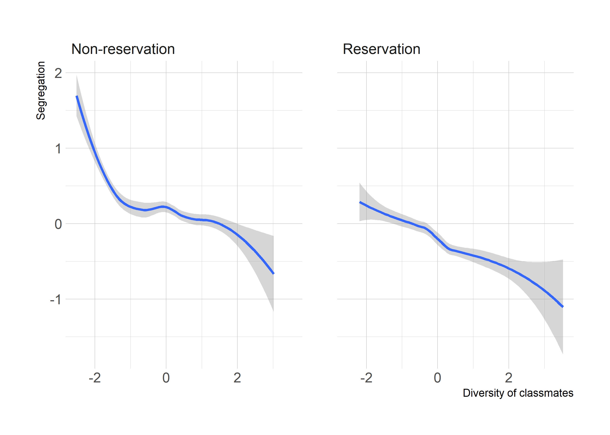
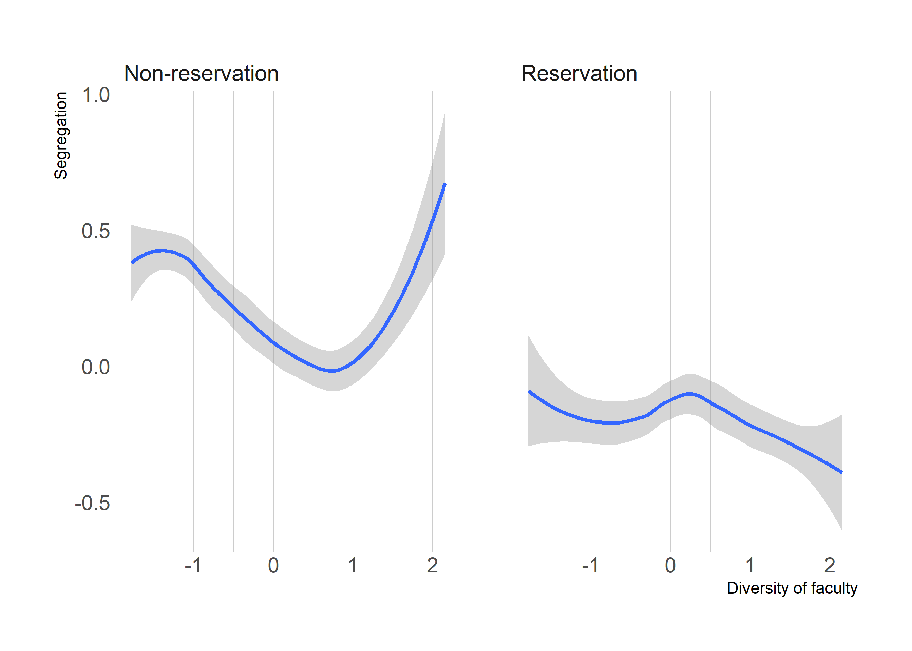

Analysis for SN Paper 1 - Experiment
================
Saurabh Khanna
2020-08-11

  - [Read in data](#read-in-data)
  - [Assigning sections](#assigning-sections)
  - [Randomization checks](#randomization-checks)
  - [Figures for non-linearity](#figures-for-non-linearity)
  - [Table 1 (All)](#table-1-all)
  - [Table 2 (Elite/Selective)](#table-2-eliteselective)
  - [Table 3 (Non-elite/non-selective)](#table-3-non-elitenon-selective)

``` r
# Libraries
library(tidyverse)
library(haven)
library(stargazer)
library(AER)
library(sandwich)
library(lmtest)
library(estimatr)

# Parameters
stufac_file <- here::here("data", "all_appended.dta")
stu_file <- here::here("data", "stu_admin_all_latest.dta")
newscores_file <- here::here("data/new_scoring/friends/newscores.Rds")
```

## Read in data

``` r
df_stu <- 
  read_dta(stu_file) %>% 
  mutate(
    reservation = dplyr::recode(reservation, "Non-reservation" = 0L, "Reservation" = 1L, .default = NA_integer_)
  )

df <- 
  read_dta(stufac_file) %>% 
  left_join(
    df_stu %>% 
      select(stdid, classid, reservation, ea_stud_group_criteria),
    by = "stdid"
  ) %>% 
  left_join(read_dta(here::here("/data/res_fac_all.dta")), by = "facid") %>% 
  filter(ea_stud_group_criteria == 2) %>% 
  drop_na(reservation)
```

## Assigning sections

``` r
sections <-
  df %>%
  group_by(classid, course_name, facid) %>% 
  summarise(
    stu_res_section = mean(reservation, na.rm = TRUE),
    n_stu = n()
  ) %>%
  ungroup() %>% 
  filter(n_stu > 1)

seg_scores <-
  df %>% 
  select(stdid, classid, course_name, facid, everything()) %>% 
  arrange(stdid, classid, course_name, facid) %>% 
  left_join(sections, by = c("classid", "course_name", "facid")) %>% 
  group_by(stdid, reservation) %>% 
  summarize(
    fac_res_prop = sum(reservation_fac * credits, na.rm = TRUE) / sum(credits, na.rm = TRUE),
    stu_res_prop = sum(stu_res_section * credits, na.rm = TRUE) / sum(credits, na.rm = TRUE)
  ) %>%
  ungroup() %>% 
  left_join(read_rds(newscores_file), by = "stdid") %>%
  left_join(df_stu %>% select(stdid, classid, elite, grade), by = "stdid") %>% 
  left_join(read_dta("data/controls.dta"), by = "stdid") %>% 
  mutate(
    # stu_diversity = stu_res_prop * (1 - stu_res_prop),
    # fac_diversity = fac_res_prop * (1 - fac_res_prop)
    stu_diversity = if_else(reservation == 0, stu_res_prop, 1 - stu_res_prop),
    fac_diversity = if_else(reservation == 0, fac_res_prop, 1 - fac_res_prop)
  ) %>% 
  filter(grade == 2) %>% 
  mutate_at(
    vars("e_seg_new", "b_seg_new", "stu_diversity", "fac_diversity"),
    ~ scale(.) %>% as.vector
  )
```

## Randomization checks

``` r
seg_scores %>%
  mutate(diversity = stu_diversity + fac_diversity) %>% 
  lm_robust(diversity ~ female + age + score + factor(father_ed_ind) + factor(mother_ed_ind) + school_years_english, data = ., fixed_effects = ~ classid) %>%
  summary()
```

    ## 
    ## Call:
    ## lm_robust(formula = diversity ~ female + age + score + factor(father_ed_ind) + 
    ##     factor(mother_ed_ind) + school_years_english, data = ., fixed_effects = ~classid)
    ## 
    ## Standard error type:  HC2 
    ## 
    ## Coefficients:
    ##                         Estimate Std. Error  t value Pr(>|t|) CI Lower
    ## female                 -0.105880   0.061361 -1.72553 0.084521 -0.22619
    ## age                     0.015666   0.032031  0.48910 0.624800 -0.04713
    ## score                  -0.128064   0.110370 -1.16031 0.246001 -0.34446
    ## factor(father_ed_ind)2 -0.074145   0.093727 -0.79107 0.428958 -0.25791
    ## factor(father_ed_ind)3  0.005124   0.113200  0.04526 0.963900 -0.21682
    ## factor(father_ed_ind)4  0.053316   0.165302  0.32253 0.747067 -0.27078
    ## factor(father_ed_ind)5 -0.051785   0.157127 -0.32958 0.741739 -0.35986
    ## factor(father_ed_ind)6  0.188024   0.169196  1.11128 0.266523 -0.14371
    ## factor(father_ed_ind)7  0.031191   0.091921  0.33933 0.734385 -0.14903
    ## factor(father_ed_ind)8  0.059908   0.098116  0.61058 0.541514 -0.13246
    ## factor(mother_ed_ind)2  0.178914   0.083358  2.14634 0.031915  0.01548
    ## factor(mother_ed_ind)3  0.104940   0.107364  0.97742 0.328429 -0.10556
    ## factor(mother_ed_ind)4 -0.038198   0.325953 -0.11719 0.906718 -0.67728
    ## factor(mother_ed_ind)5 -0.009876   0.265135 -0.03725 0.970288 -0.52971
    ## factor(mother_ed_ind)6 -0.295934   0.155414 -1.90416 0.056972 -0.60065
    ## factor(mother_ed_ind)7 -0.248653   0.090794 -2.73866 0.006200 -0.42667
    ## factor(mother_ed_ind)8 -0.281848   0.098957 -2.84819 0.004423 -0.47587
    ## school_years_english   -0.007480   0.006312 -1.18504 0.236081 -0.01986
    ##                         CI Upper   DF
    ## female                  0.014427 3486
    ## age                     0.078468 3486
    ## score                   0.088333 3486
    ## factor(father_ed_ind)2  0.109621 3486
    ## factor(father_ed_ind)3  0.227068 3486
    ## factor(father_ed_ind)4  0.377415 3486
    ## factor(father_ed_ind)5  0.256285 3486
    ## factor(father_ed_ind)6  0.519757 3486
    ## factor(father_ed_ind)7  0.211416 3486
    ## factor(father_ed_ind)8  0.252280 3486
    ## factor(mother_ed_ind)2  0.342348 3486
    ## factor(mother_ed_ind)3  0.315442 3486
    ## factor(mother_ed_ind)4  0.600881 3486
    ## factor(mother_ed_ind)5  0.509960 3486
    ## factor(mother_ed_ind)6  0.008778 3486
    ## factor(mother_ed_ind)7 -0.070639 3486
    ## factor(mother_ed_ind)8 -0.087829 3486
    ## school_years_english    0.004896 3486
    ## 
    ## Multiple R-squared:  0.2311 ,    Adjusted R-squared:  0.2191
    ## Multiple R-squared (proj. model):  0.01381 , Adjusted R-squared (proj. model):  -0.001471 
    ## F-statistic (proj. model): 2.839 on 18 and 3486 DF,  p-value: 5.604e-05

## Figures for non-linearity

``` r
seg_scores %>% 
  mutate(
    reservation = factor(reservation, labels = c("Non-reservation", "Reservation"))
  ) %>%
  ggplot(aes(stu_diversity, e_seg_new)) +
  geom_smooth(method = "loess") +
  facet_wrap(vars(reservation)) +
  hrbrthemes::theme_ipsum() +
  labs(
    x = "Diversity of classmates",
    y = "Segregation"
  )
```



``` r
seg_scores %>% 
  mutate(
    reservation = factor(reservation, labels = c("Non-reservation", "Reservation"))
  ) %>%
  ggplot(aes(fac_diversity, e_seg_new)) +
  geom_smooth(method = "loess") +
  facet_wrap(vars(reservation)) +
  hrbrthemes::theme_ipsum() +
  labs(
    x = "Diversity of faculty",
    y = "Segregation"
  )
```



## Table 1 (All)

``` r
lm1 <-
  seg_scores %>%
  filter(reservation == 1) %>% 
  lm(e_seg_new ~ b_seg_new + stu_diversity + classid + female + age + score + factor(father_ed_ind) + factor(mother_ed_ind) + school_years_english, data = .)

lm2 <-
  seg_scores %>%
  filter(reservation == 0) %>% 
  lm(e_seg_new ~ b_seg_new + stu_diversity + classid + female + age + score + factor(father_ed_ind) + factor(mother_ed_ind) + school_years_english, data = .)

lm3 <-
  seg_scores %>%
  filter(reservation == 1) %>% 
  lm(e_seg_new ~ b_seg_new + fac_diversity + classid + female + age + score + factor(father_ed_ind) + factor(mother_ed_ind) + school_years_english, data = .)

lm4 <-
  seg_scores %>%
  filter(reservation == 0) %>% 
  lm(e_seg_new ~ b_seg_new + fac_diversity + classid + female + age + score + factor(father_ed_ind) + factor(mother_ed_ind) + school_years_english, data = .)

rob_se <-
  list(
    sqrt(diag(vcovHC(lm1, type = "HC1"))),
    sqrt(diag(vcovHC(lm2, type = "HC1"))),
    sqrt(diag(vcovHC(lm3, type = "HC1"))),
    sqrt(diag(vcovHC(lm4, type = "HC1")))
  )

stargazer(
  lm1, lm2, lm3, lm4,
  se = rob_se,
  title = "Table 4: Effects of diversity of classmates and faculty on segregation",
  header = F,
  digits = 2,
  model.numbers = F,
  dep.var.caption  = "Segregation (by student reservation status)",
  dep.var.labels.include  = F,
  column.labels   = c("Reservation", "Non-reservation", "Reservation", "Non-reservation"),
  covariate.labels = c("Diversity of classmates", "Diversity of faculty", "Constant"),
  keep = c("stu_diversity", "fac_diversity", "Constant"),
  keep.stat = c("n"),
  type = "html",
  out = "testing.html",
  notes = c(
    "All models control for pre-treatment student characteristics and department-year fixed effects."
  )
)
```

## Table 2 (Elite/Selective)

``` r
lm1 <-
  seg_scores %>%
  filter(reservation == 1, elite == 1) %>% 
  lm(e_seg_new ~ b_seg_new + stu_diversity + classid + female + age + score + father_ed_ind + mother_ed_ind + school_years_english, data = .)

lm2 <-
  seg_scores %>%
  filter(reservation == 0, elite == 1) %>% 
  lm(e_seg_new ~ b_seg_new + stu_diversity + classid + female + age + score + father_ed_ind + mother_ed_ind + school_years_english, data = .)

lm3 <-
  seg_scores %>%
  filter(reservation == 1, elite == 1) %>% 
  lm(e_seg_new ~ b_seg_new + fac_diversity + classid + female + age + score + father_ed_ind + mother_ed_ind + school_years_english, data = .)

lm4 <-
  seg_scores %>%
  filter(reservation == 0, elite == 1) %>% 
  lm(e_seg_new ~ b_seg_new + fac_diversity + classid + female + age + score + father_ed_ind + mother_ed_ind + school_years_english, data = .)

rob_se <-
  list(
    sqrt(diag(vcovHC(lm1, type = "HC1"))),
    sqrt(diag(vcovHC(lm2, type = "HC1"))),
    sqrt(diag(vcovHC(lm3, type = "HC1"))),
    sqrt(diag(vcovHC(lm4, type = "HC1")))
  )

stargazer(
  lm1, lm2, lm3, lm4,
  se = rob_se,
  title = "Table 5: Effects of diversity of classmates and faculty on segregation at selective colleges",
  header = F,
  digits = 2,
  model.numbers = F,
  dep.var.caption  = "Segregation (by student reservation status)",
  dep.var.labels.include  = F,
  column.labels   = c("Reservation", "Non-reservation", "Reservation", "Non-reservation"),
  covariate.labels = c("Diversity of classmates", "Diversity of faculty", "Constant"),
  keep = c("diversity", "fac_res", "Constant"),
  keep.stat = c("n"),
  type = "html",
  out = "testing.html",
  notes = c(
    "All models control for pre-treatment student characteristics and department-year fixed effects."
  )
)
```

## Table 3 (Non-elite/non-selective)

``` r
lm1 <-
  seg_scores %>%
  filter(reservation == 1, elite == 0) %>% 
  lm(e_seg_new ~ b_seg_new + stu_diversity + classid + female + age + score + father_ed_ind + mother_ed_ind + school_years_english, data = .)

lm2 <-
  seg_scores %>%
  filter(reservation == 0, elite == 0) %>% 
  lm(e_seg_new ~ b_seg_new + stu_diversity + classid + female + age + score + father_ed_ind + mother_ed_ind + school_years_english, data = .)

lm3 <-
  seg_scores %>%
  filter(reservation == 1, elite == 0) %>% 
  lm(e_seg_new ~ b_seg_new + fac_diversity + classid + female + age + score + father_ed_ind + mother_ed_ind + school_years_english, data = .)

lm4 <-
  seg_scores %>%
  filter(reservation == 0, elite == 0) %>% 
  lm(e_seg_new ~ b_seg_new + fac_diversity + classid + female + age + score + father_ed_ind + mother_ed_ind + school_years_english, data = .)

rob_se <-
  list(
    sqrt(diag(vcovHC(lm1, type = "HC1"))),
    sqrt(diag(vcovHC(lm2, type = "HC1"))),
    sqrt(diag(vcovHC(lm3, type = "HC1"))),
    sqrt(diag(vcovHC(lm4, type = "HC1")))
  )

stargazer(
  lm1, lm2, lm3, lm4,
  se = rob_se,
  title = "Table 6: Effects of diversity of classmates and faculty on segregation at non-selective colleges",
  header = F,
  digits = 2,
  model.numbers = F,
  dep.var.caption  = "Segregation (by student reservation status)",
  dep.var.labels.include  = F,
  column.labels   = c("Reservation", "Non-reservation", "Reservation", "Non-reservation"),
  covariate.labels = c("Diversity of classmates", "Diversity of faculty", "Constant"),
  keep = c("diversity", "fac_res", "Constant"),
  keep.stat = c("n"),
  type = "html",
  out = "testing.html",
  notes = c(
    "All models control for pre-treatment student characteristics and department-year fixed effects."
  )
)
```
