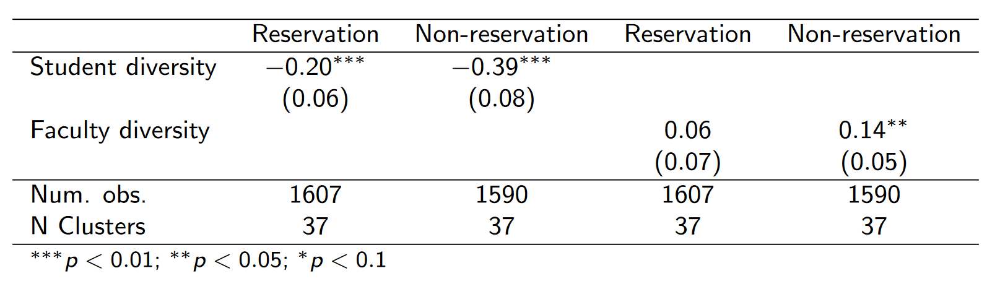

```{r setup, include=FALSE, warning=FALSE, message=FALSE}
knitr::opts_chunk$set(echo = F, message = F, warning = F, fig.retina = 4)
```

# Research Questions

1. How do institutional dynamics affect segregation based on affirmative action quotas?

--

2. Do these effects differ for advantaged versus disadvantaged students?

--


<br/><br/><br/>
Why?

---

class: inverse, center, middle

# Data

---

# Data

* 50 randomly sampled engineering colleges in India
 + 100 departments (2 per college)
 + 200 cohorts (2 per department)
 + 20,239 students


--

        
* Affirmative Action/Reservation
  + Quotas _reserved_ for students from historically disadvantaged backgrounds<sup>1</sup>
  + __Reservation students__: Those who gain admission based on these quotas
  + __Non-Reservation students__: Those who don't

.footnote[[1] Scheduled Castes (SCs), Scheduled Tribes (STs), and Other Backward Classes (OBCs)]

--


* Directed network data for each cohort
  + Students nominate upto 10 friends
  + Longitudinal data - 2 time points (Gap of ~2 years)
  

--

* Also surveyed 100 department heads and 3,477 faculty

---

class: inverse, center, middle

# Descriptives

---

# Segregation Score

```{r table1}
pacman::p_load(tidyverse, sf, plotly, haven)
dplyr::tribble(
    ~"", ~"Friend (f)", ~"Not friend (f')",   
    "Reservation (r)",    "A",     "C",
    "Non-reservation (nr)",    "B",     "D"
) %>%
knitr::kable(format = "html")
```
<br/>


--


Natural log of the odds that a student will nominate a friend in their own category, relative to the odds that they will nominate someone in a different category (Moody, 2001)

$$segregation_{r} = log \left[\frac{f_{r}}{f_{nr}}\times\frac{f'_{nr}}{f'_{r}} \right] = log \left(\frac{AD}{BC} \right)$$
$$segregation_{nr} = log \left[\frac{f_{nr}}{f_{r}}\times\frac{f'_{r}}{f'_{nr}} \right] = log \left(\frac{BC}{AD} \right)$$

<br/>

--
$+$ score $\to$ More within category friendships <br/>
$-$ score $\to$ More across category friendships <br/>
0 $\to$ Optimum within/across category friendships (Preference = Opportunity)

---

## Segregation Levels

Non-reservation students tend to segregate more, and it sustains.

.center[
```{r}
read_csv(here::here("data/slides_v2_data.csv")) %>%
  mutate(
    z_seg_g1 = (exp(z_seg_g1) / (1 + exp(z_seg_g1))) %>% round(2),
    z_seg_g2 = (exp(z_seg_g2) / (1 + exp(z_seg_g2))) %>% round(2),
    z_seg_g3 = (exp(z_seg_g3) / (1 + exp(z_seg_g3))) %>% round(2),
    z_seg_g4 = (exp(z_seg_g4) / (1 + exp(z_seg_g4))) %>% round(2)
  ) %>% 
  select(starts_with("z_seg"), reservation) %>%
  drop_na(reservation) %>%
  group_by(reservation) %>%
  summarize_all(mean, na.rm = T) %>%
  ungroup() %>% 
  pivot_longer(cols = starts_with("z"), names_to = "year", values_to = "seg") %>% 
  mutate(
    year = year %>% parse_number() %>% as.integer(),
    reservation = dplyr::recode(reservation, `0` = "Non-reservation", `1` = "Reservation", .default = NA_character_)
    ) %>% 
  ggplot(aes(year, seg, group = reservation, fill = factor(reservation))) +
  geom_col(position = "dodge", color = "black") +
  geom_hline(yintercept = 0.5, linetype = "dashed") +
  scale_y_continuous(
    breaks = seq(0, 1, 0.1),
    labels = scales::percent_format(accuracy = 1)
  ) +
  theme_bw() +
  theme(legend.position = "bottom") +
  labs(
    x = "Year of college",
    y = "Probability",
    title = "Probability of within-category friendships",
    subtitle = "Controlling for cohort composition",
    fill = "Student Reservation Status"
  )
```
]

---

```{r}
# read_dta(here::here("data", "stu_admin_all_latest.dta")) %>%
#   left_join(read_rds(here::here("data/new_scoring/friends/newscores.Rds")), by = "stdid") %>%
#   mutate(
#     reservation = dplyr::recode(reservation, "Non-reservation" = 0L, "Reservation" = 1L, .default = NA_integer_),
#     z_seg_g1 = if_else(grade == 2, b_seg_new, NA_real_),
#     z_seg_g2 = if_else(grade == 2, e_seg_new, NA_real_),
#     z_seg_g3 = if_else(grade == 4, b_seg_new, NA_real_),
#     z_seg_g4 = if_else(grade == 4, e_seg_new, NA_real_)
#   ) %>%
#   select(stdid, reservation, contains("_seg_"), state = state_india, grade) %>%
#   write_csv(here::here("data/slides_v2_data.csv"))
```

# Spatial distribution of Segregation
### Timepoint 1

```{r}
read_csv(here::here("data/slides_v2_data.csv")) %>%
  mutate(
    b_seg_new = (exp(b_seg_new) / (1 + exp(b_seg_new))) %>% round(2),
    e_seg_new = (exp(e_seg_new) / (1 + exp(e_seg_new))) %>% round(2),
  ) %>% 
  group_by(state) %>% 
  summarize(Segregation = mean(b_seg_new, na.rm = T) %>% round(2)) %>%
  left_join(
    read_sf(here::here("data/india_states.geojson")) %>% 
      rename(state = NAME_1) %>% 
      mutate(state = if_else(state == "Orissa", "Odisha", state)),
    .,
    by = "state"
  ) %>%
  ggplot(aes(text = state, fill = Segregation), size = 0.3) +
  geom_sf() +
  scale_fill_gradientn(
    colors = RColorBrewer::brewer.pal(n = 9, name = "PuRd"),
    labels = scales::percent_format(accuracy = 1)
  ) +
  theme_minimal() +
  theme(legend.position = "bottom")
```


---

# Spatial distribution of Segregation
### Timepoint 2

```{r}
read_csv(here::here("data/slides_v2_data.csv")) %>%
  mutate(
    b_seg_new = (exp(b_seg_new) / (1 + exp(b_seg_new))) %>% round(2),
    e_seg_new = (exp(e_seg_new) / (1 + exp(e_seg_new))) %>% round(2),
  ) %>% 
  group_by(state) %>% 
  summarize(Segregation = mean(e_seg_new, na.rm = T) %>% round(2)) %>%
  left_join(
    read_sf(here::here("data/india_states.geojson")) %>% 
      rename(state = NAME_1) %>% 
      mutate(state = if_else(state == "Orissa", "Odisha", state)),
    .,
    by = "state"
  ) %>%
  ggplot(aes(text = state, fill = Segregation), size = 0.3) +
  geom_sf() +
  scale_fill_gradientn(
    colors = RColorBrewer::brewer.pal(n = 9, name = "PuRd"),
    labels = scales::percent_format(accuracy = 1)
  ) +
  theme_minimal() +
  theme(legend.position = "bottom")
```

---

class: inverse, center, middle

# Experimental Analysis
### How does diversity affect segregation?

---

# Model

In 37 of the 100 surveyed departments, students were randomly assigned _sections_ for all courses taken during the first two years of college.

<br/>
For a reservation/non-reservation student $i$ assigned a section $s$:

> $$seg_{i,s} = \beta_0 + \beta_1 diversity_{i,s} + \beta_2 stucontrols_i + \beta_3 dept_s + \epsilon_{i,s}$$


<br/>
  $diversity_{i,s}$ proxies:
  * Diversity of classmates in section
    + Proportion of classmates in section $s$ unlike student $i$
  * Diversity of faculty teaching a section
    + Proportion of faculty in section $s$ unlike student $i$
    

---

# Preliminary results

* A diverse student body reduces segregation for all students.

* A diverse faculty body increases segregation for non-reservation students.

<br/>

     
---

class: inverse, center, middle

# Quasi-Experimental Analysis
### How do institutional policies affect segregation?

---

# Method 1: Regression

For a reservation/non-reservation student $i$ at time points $t_1$ and $t_2$:
<br/><br/>

> $$seg_{i,t_2} = \beta_0 + \beta_1 policy_i + \beta_2 seg_{i,t_1} + \beta_3 stucontrols_i + \epsilon_i$$

<br/><br/>

--

$policy_i$ can be:

1. Maintaining diverse dormitories
2. Establishing mentoring programs
3. Holding integration seminars
4. A functional diversity office

---

# Preliminary Results

* Diverse dorms reduce segregation for non-reservation students throughout college.

* Mentoring programs reduce segregation for reservation students at the start of college, and for non-reservation student towards the end of college.

* Integration courses and Diversity offices have small effects towards reducing segregation.


---

# Method 2: Multilevel STERGM
### Model - Level 1

For each of the 200 classrooms, I run:

```{r, eval = F, echo=T}
stergm(
  list(network_t1, network_t2),
  formation = 
    ~ edges + nodefactor("reservation") + nodematch("reservation") + nodefactor("female") + nodematch("female") + nodefactor("ses") + nodematch("ses") + nodefactor("area") + nodematch("area") + nodecov("score") + absdiff("score") + mutual + gwesp(0.25),
  dissolution = 
    ~ edges + nodefactor("reservation") + nodematch("reservation") + nodefactor("female") + nodematch("female") + nodefactor("ses") + nodematch("ses") + nodefactor("area") + nodematch("area") + nodecov("score") + absdiff("score") + mutual + gwesp(0.25),
  estimate = "CMLE",
  times = 1:2,
  control = control.stergm(seed = 100, MLE.MCMC.burnin=50000, CMLE.MCMC.interval=2000)
)
```


--

<br/>
No convergence for 27 classrooms

Degenerate results for 8 classrooms

---

# Model - Level 2

Extracting model coefficients and standard errors from Level 1

Synthesizing effect sizes using a random effects model


Meta-regression using level 2 covariates:

1. Maintaining diverse dormitories
2. Establishing mentoring programs
3. Holding integration seminars
4. A functional diversity office

---

# Preliminary Results

### Level 1

* Reciprocal relations 78% likely to form and 83% likely to persist

* Clustered relations 63% likely to form and 65% likely to persist

* Homophilous connections based on affirmative action status 48% likely to form and persist

--

### Level 2

* Coefficient signs match regression model results (implicit policies reducing affirmative action based homophily), but not significant


---

### Questions

1. Reconcile network models (STERGMs, SOAMs) with econometric literature

2. Visualize multiple networks
  - Cluster?

---


class: middle

Feedback/Questions

<br/><br/><br/>

Code here: https://github.com/saurabh-khanna


